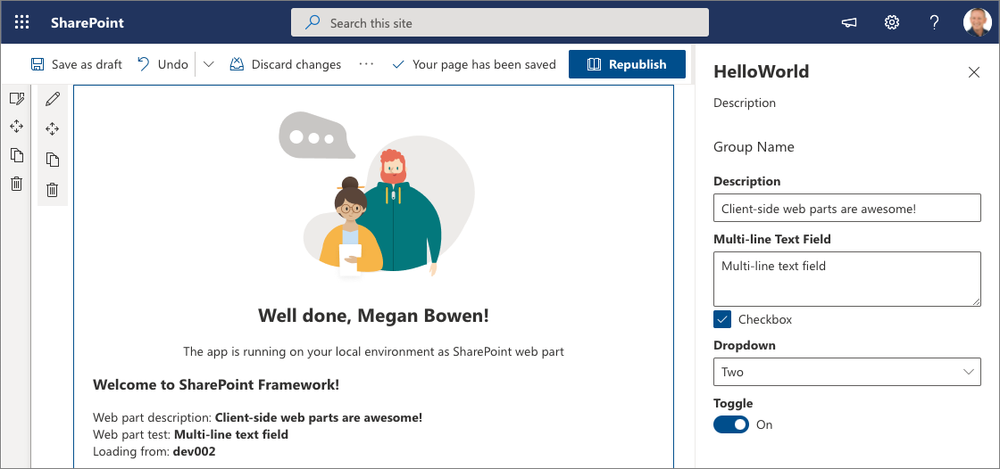

# Hello World web part

## Summary

Client-side web parts are client-side components that run in the context of a SharePoint page. Client-side web parts can be deployed to SharePoint environments that support the SharePoint Framework. You can also use modern JavaScript web frameworks, tools, and libraries to build them.

## Exercises

1. [Build your first SharePoint client-side web part (Hello World part 1)](https://learn.microsoft.com/et-ee/sharepoint/dev/spfx/web-parts/get-started/build-a-hello-world-web-part)
2. [Connect your client-side web part to SharePoint](https://learn.microsoft.com/et-ee/sharepoint/dev/spfx/web-parts/get-started/connect-to-sharepoint)
3. [Deploy your client-side web part to a SharePoint page (Hello World part 3)](https://learn.microsoft.com/et-ee/sharepoint/dev/spfx/web-parts/get-started/serve-your-web-part-in-a-sharepoint-page)
4. [Host your client-side web part from Microsoft 365 CDN (Hello World part 4)](https://learn.microsoft.com/et-ee/sharepoint/dev/spfx/web-parts/get-started/hosting-webpart-from-office-365-cdn)

## Used SharePoint Framework Version

## Applies to

- [SharePoint Framework](https://aka.ms/spfx)
- [Microsoft 365 tenant](https://docs.microsoft.com/en-us/sharepoint/dev/spfx/set-up-your-developer-tenant)

> Get your own free development tenant by subscribing to [Microsoft 365 developer program](http://aka.ms/o365devprogram)

## Disclaimer

**THIS CODE IS PROVIDED _AS IS_ WITHOUT WARRANTY OF ANY KIND, EITHER EXPRESS OR IMPLIED, INCLUDING ANY IMPLIED WARRANTIES OF FITNESS FOR A PARTICULAR PURPOSE, MERCHANTABILITY, OR NON-INFRINGEMENT.**

## References

- [Getting started with SharePoint Framework](https://docs.microsoft.com/en-us/sharepoint/dev/spfx/set-up-your-developer-tenant)
- [Building for Microsoft teams](https://docs.microsoft.com/en-us/sharepoint/dev/spfx/build-for-teams-overview)
- [Use Microsoft Graph in your solution](https://docs.microsoft.com/en-us/sharepoint/dev/spfx/web-parts/get-started/using-microsoft-graph-apis)
- [Publish SharePoint Framework applications to the Marketplace](https://docs.microsoft.com/en-us/sharepoint/dev/spfx/publish-to-marketplace-overview)
- [Microsoft 365 Patterns and Practices](https://aka.ms/m365pnp) - Guidance, tooling, samples and open-source controls for your Microsoft 365 development
