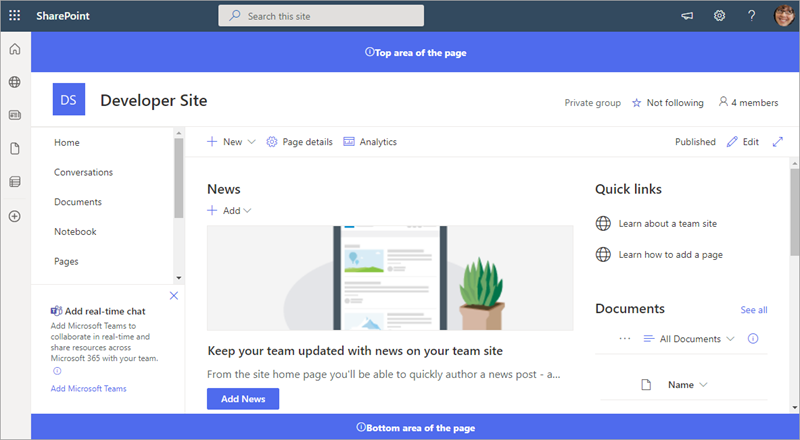

# Hello World Application Customizer

## Summary

SharePoint Framework (SPFx) Extensions are client-side components that run inside the context of a SharePoint page. You can deploy extensions to SharePoint Online, and you can use modern JavaScript tools and libraries to build them.

    

## Exercises

1. [Build your first SharePoint Framework Extension (Hello World part 1)](https://learn.microsoft.com/et-ee/sharepoint/dev/spfx/extensions/get-started/build-a-hello-world-extension)
2. [Use page placeholders from Application Customizer (Hello World part 2)](https://learn.microsoft.com/et-ee/sharepoint/dev/spfx/extensions/get-started/using-page-placeholder-with-extensions)
3. [Deploy your extension to SharePoint (Hello World part 3)](https://learn.microsoft.com/et-ee/sharepoint/dev/spfx/extensions/get-started/serving-your-extension-from-sharepoint)
4. [Host an SPFx extension from the Microsoft 365 CDN (Hello World part 4)](https://learn.microsoft.com/et-ee/sharepoint/dev/spfx/extensions/get-started/hosting-extension-from-office365-cdn)
5. [Configure extension icon](https://learn.microsoft.com/et-ee/sharepoint/dev/spfx/extensions/basics/configure-extension-icon)

## Used SharePoint Framework Version

## Applies to

- [SharePoint Framework](https://aka.ms/spfx)
- [Microsoft 365 tenant](https://docs.microsoft.com/en-us/sharepoint/dev/spfx/set-up-your-developer-tenant)

> Get your own free development tenant by subscribing to [Microsoft 365 developer program](http://aka.ms/o365devprogram)

## Disclaimer

**THIS CODE IS PROVIDED _AS IS_ WITHOUT WARRANTY OF ANY KIND, EITHER EXPRESS OR IMPLIED, INCLUDING ANY IMPLIED WARRANTIES OF FITNESS FOR A PARTICULAR PURPOSE, MERCHANTABILITY, OR NON-INFRINGEMENT.**

## References

- [Getting started with SharePoint Framework](https://docs.microsoft.com/en-us/sharepoint/dev/spfx/set-up-your-developer-tenant)
- [Building for Microsoft teams](https://docs.microsoft.com/en-us/sharepoint/dev/spfx/build-for-teams-overview)
- [Use Microsoft Graph in your solution](https://docs.microsoft.com/en-us/sharepoint/dev/spfx/web-parts/get-started/using-microsoft-graph-apis)
- [Publish SharePoint Framework applications to the Marketplace](https://docs.microsoft.com/en-us/sharepoint/dev/spfx/publish-to-marketplace-overview)
- [Microsoft 365 Patterns and Practices](https://aka.ms/m365pnp) - Guidance, tooling, samples and open-source controls for your Microsoft 365 development