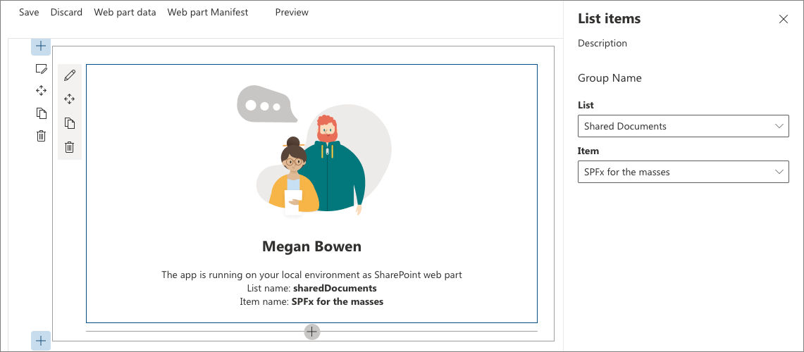

# Web part property pane custom control using React

## Summary

The SharePoint Framework contains a set of standard controls for the property pane. But sometimes you need additional functionality beyond the basic controls. You might need asynchronous updates to the data on a control or a specific user interface. Build a custom control for the property pane to get the functionality you need. You'll build a custom dropdown control that loads its data asynchronously from an external service without blocking the user interface of the web part.

    

## Exercises

* [Build custom controls for the property pane](https://learn.microsoft.com/et-ee/sharepoint/dev/spfx/web-parts/guidance/build-custom-property-pane-controls)

## Used SharePoint Framework Version

## Applies to

- [SharePoint Framework](https://aka.ms/spfx)
- [Microsoft 365 tenant](https://docs.microsoft.com/en-us/sharepoint/dev/spfx/set-up-your-developer-tenant)

> Get your own free development tenant by subscribing to [Microsoft 365 developer program](http://aka.ms/o365devprogram)

## Disclaimer

**THIS CODE IS PROVIDED _AS IS_ WITHOUT WARRANTY OF ANY KIND, EITHER EXPRESS OR IMPLIED, INCLUDING ANY IMPLIED WARRANTIES OF FITNESS FOR A PARTICULAR PURPOSE, MERCHANTABILITY, OR NON-INFRINGEMENT.**

## References

- [Getting started with SharePoint Framework](https://docs.microsoft.com/en-us/sharepoint/dev/spfx/set-up-your-developer-tenant)
- [Building for Microsoft teams](https://docs.microsoft.com/en-us/sharepoint/dev/spfx/build-for-teams-overview)
- [Use Microsoft Graph in your solution](https://docs.microsoft.com/en-us/sharepoint/dev/spfx/web-parts/get-started/using-microsoft-graph-apis)
- [Publish SharePoint Framework applications to the Marketplace](https://docs.microsoft.com/en-us/sharepoint/dev/spfx/publish-to-marketplace-overview)
- [Microsoft 365 Patterns and Practices](https://aka.ms/m365pnp) - Guidance, tooling, samples and open-source controls for your Microsoft 365 development