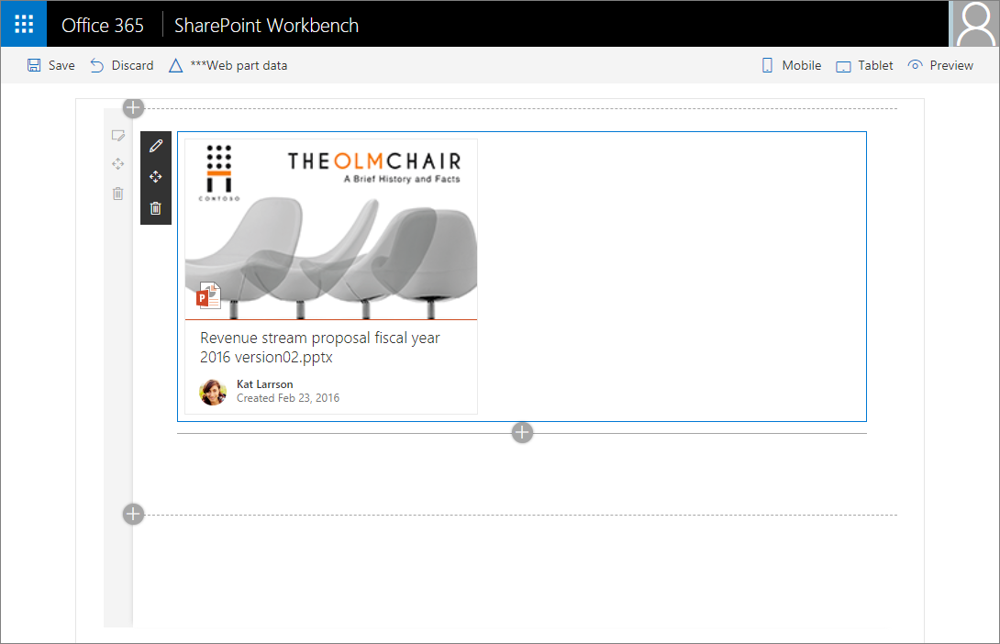

# Using Fluent UI components in web part

## Summary

Office UI Fabric React is the front-end framework for building experiences for Office and Office 365. It includes a robust collection of responsive, mobile-first components that make it easy for you to create web experiences by using the Office Design Language.

    

## Exercises

* [Use Office UI Fabric React components in your SharePoint client-side web part](https://learn.microsoft.com/et-ee/sharepoint/dev/spfx/web-parts/get-started/use-fabric-react-components)

## Used SharePoint Framework Version

## Applies to

- [SharePoint Framework](https://aka.ms/spfx)
- [Microsoft 365 tenant](https://docs.microsoft.com/en-us/sharepoint/dev/spfx/set-up-your-developer-tenant)

> Get your own free development tenant by subscribing to [Microsoft 365 developer program](http://aka.ms/o365devprogram)

## Disclaimer

**THIS CODE IS PROVIDED _AS IS_ WITHOUT WARRANTY OF ANY KIND, EITHER EXPRESS OR IMPLIED, INCLUDING ANY IMPLIED WARRANTIES OF FITNESS FOR A PARTICULAR PURPOSE, MERCHANTABILITY, OR NON-INFRINGEMENT.**

## References

- [Getting started with SharePoint Framework](https://docs.microsoft.com/en-us/sharepoint/dev/spfx/set-up-your-developer-tenant)
- [Building for Microsoft teams](https://docs.microsoft.com/en-us/sharepoint/dev/spfx/build-for-teams-overview)
- [Use Microsoft Graph in your solution](https://docs.microsoft.com/en-us/sharepoint/dev/spfx/web-parts/get-started/using-microsoft-graph-apis)
- [Publish SharePoint Framework applications to the Marketplace](https://docs.microsoft.com/en-us/sharepoint/dev/spfx/publish-to-marketplace-overview)
- [Microsoft 365 Patterns and Practices](https://aka.ms/m365pnp) - Guidance, tooling, samples and open-source controls for your Microsoft 365 development